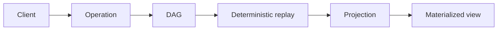

# NodalMerge

> A local-first distributed state engine built around immutable operations —
> replayed deterministically into programmable projections.

NodalMerge lets you build collaborative, offline-first, and distributed
applications without designing your own synchronization, conflict resolution,
replay, or replication layer. You write locally, merge concurrently, and
converge deterministically — with full audit-grade replay semantics.

**📚 Full documentation: [docs.nodalmerge.com](https://docs.nodalmerge.com)** ·
**🌐 [nodalmerge.com](https://nodalmerge.com)** (live demos & playgrounds)

---

## The idea

Most systems revolve around mutable state: a document or row that gets
overwritten in place, with conflicts patched heuristically after the fact.
NodalMerge instead treats **operations as the primary primitive**. State
changes are appended as immutable, hash-linked nodes in a DAG; state itself is
a **projection** — deterministically materialized by replaying those operations
at any point in history.

From that single model come snapshots, branching, replay, auditing,
replication, and deterministic synchronization — not as separate subsystems,
but as natural consequences of representing state as immutable operations.



It's a strong fit for editors, operational consoles, multiplayer workflows, and
AI-assisted workspaces — anywhere you need low-latency collaboration without
giving up deterministic correctness. See
[Why NodalMerge](https://docs.nodalmerge.com/why-nodalmerge) for the full
fit/no-fit breakdown.

## Core capabilities

- **Deterministic CRDT merge** — all peers converge to the same canonical state
  regardless of write order or network partitions.
- **Replay-grade history DAG** — every change is a node in an append-only DAG;
  replay any window, branch, or ancestor state on demand.
- **Full offline queue** — writes queue locally while disconnected and flush
  deterministically on reconnect, with no data loss.
- **Cryptographic identity** — peers are Ed25519 keypairs; every node is signed
  and content-addressed with Blake3.
- **Authority-scoped policies** — lock write authority to specific key paths and
  peers via capability globs (`read:world/**`, `write:intent/**`); violations
  are rejected, not silently dropped.
- **Speculative & authoritative lanes** — separate optimistic intent from
  canonical accepted state, then converge both in one model.
- **Three primitives** — a LWW **Map**, character-level RGA **Text**, and
  content-addressed **Blob** storage with automatic dedup and GC.

## Real-world measurements

Numbers from a real 259,778-edit editing trace — hash-linked DAG,
per-character identity, and policy checks all included. See
[benchmarks/text-engine-performance](https://docs.nodalmerge.com/benchmarks/text-engine-performance)
for methodology and how to read them safely.

| Throughput | Where |
|---|---|
| **294,521 ops/sec** | Native Rust core |
| **119,482 ops/sec** | Same engine in-browser via WASM |
| **27,110 ops/sec** | Same browser run, with an Ed25519 signature on **every** operation |

## Three ways to use it

One deterministic core, exposed three ways:

1. **Standalone WebSocket server** (`nodalmerge-server`) — the mature path: rooms,
   fan-out, IBF/MST sync, policy enforcement, persistence, metrics, replay CLI.
2. **Embeddable host runtime** (`host-core` behind a C ABI) — consumed by the
   .NET host, which layers durability (Mongo, SQLite, file/S3 blobs) on top.
3. **WASM bridge** (`bridge-wasm` + `sdk-js`) — the same core running in the
   browser with IndexedDB peer-local persistence.

## Quickstart

**Run the server:**

```bash
# Native, from the repo root
cargo run -p nodalmerge-server -- --store ./data --metrics-addr 127.0.0.1:9090

# Or via Docker
docker run -p 7878:7878 -v $PWD/data:/data nodalmerge/server
```

The server logs `NodalMerge server listening on ws://127.0.0.1:7878/ws/<room>`
once ready.

**Connect a client:**

```bash
npm install nodalmerge-sdk-js
```

```js
import { createDoc } from 'nodalmerge-sdk-js';

const doc = await createDoc({
  serverUrl: 'ws://localhost:7878',
  room:      'my-first-room',
});

// LWW Map — objects, configs, references
const users = doc.map('users');
users.set('alice', { name: 'Alice', color: '#3af' });

// RGA Text — collaborative editing
const notes = doc.text('notes/welcome');
notes.insert(0, 'Hello, world!');

// Content-addressed Blob — images, audio, files
const hash = await users.setBlob('logo.png', bytes);

doc.onChange(() => rerender());
```

`createDoc` handles WebSocket reconnect, Ed25519 identity, the handshake
(frontier + IBF/MST diff), catch-up, and steady-state broadcast. See the
[Quickstart](https://docs.nodalmerge.com/quickstart) and
[SDK reference](https://docs.nodalmerge.com/sdk/javascript) for the full API.

## Repository layout

```
core/       nodalmerge-core, -gc   deterministic CRDT runtime (DAG, Blake3,
                                    Ed25519, RGA text, replay, policy) + GC
engine/     host-core, host-ffi,   embeddable HostEngine, its C ABI, and the
            commands               shared command registry both engines run
server/     server, dev-server,    standalone Axum WS server, hosted dev
            axum-embed, s3-blobs,  server, embed adapter, blob & store crates,
            jwt-bridge, stores/    and the third-party-JWT → RoomToken bridge
peer/       runtime-local(-ffi),   durable peer-local persistence (SQLite),
            headless, cli          its C ABI, and headless/CLI peers
hosts/      dotnet/                ASP.NET host over the FFI, ships native libs
                                   as NuGet packages
clients/    bridge-wasm, sdk-js,   WASM facade, JS SDK, and demo web client
            web
```

Full detail — the two-engine design, FFI surfaces, identity/auth, persistence,
and observability — lives in [ARCHITECTURE.md](ARCHITECTURE.md).

## Documentation

Everything is at **[docs.nodalmerge.com](https://docs.nodalmerge.com)**:

- [Quickstart](https://docs.nodalmerge.com/quickstart) — stand up a server and connect a client
- [Architecture overview](https://docs.nodalmerge.com/architecture/overview) — system model, CRDT behavior, replay
- [SDK reference](https://docs.nodalmerge.com/sdk/javascript) — sync, text, presence, blobs, offline
- [Protocol](https://docs.nodalmerge.com/protocol/websocket-messages) — wire format & sync flow
- [Operators](https://docs.nodalmerge.com/operators/server-setup) — setup, persistence, GC, metrics, replay
- [Benchmarks](https://docs.nodalmerge.com/benchmarks/performance-overview) — performance & runtime attribution

Repo-internal engineering docs (contracts, schemas, remediation plans) live in
[docs/](docs/), and the benchmark harness in [benchmarks/](benchmarks/).

## Building

NodalMerge is a Rust workspace (edition 2021). Standard build & test:

```bash
cargo build --release
cargo test
```

The .NET host and native NuGet packages are built via the packaging scripts
([pack-local-artifacts.ps1](pack-local-artifacts.ps1)); see
[docs/self-host.md](docs/self-host.md) and
[docs/integration.md](docs/integration.md) for embedding and store wiring.
